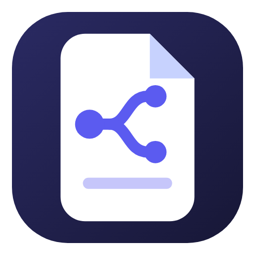

<!-- narrata:landing:start -->

  

<h1 align="center">Narrata</h1>

Рабочая среда нарративного дизайнера и сценариста: графы диалогов и квестов, база персонажей, холсты, проверка сценария и командная работа через GitHub — бесплатно и без своего сервера.

  
  
  

<a href="https://github.com/DalniyX/narrata-releases/releases/latest"><b>⬇️ Скачать для Windows и Android</b></a>

## Возможности

- 🕸️ **Графы диалогов и квестов** — ветвления, условия, переменные, симулятор прохождения
- 👥 **База персонажей** — карточки, связи, актёры озвучки, реплики по сценам
- 🧩 **Холст** — заметки, документы, картинки и ссылки на одной доске
- ✅ **Проверка сценария** — тупики, недостижимые ветки, ошибки в условиях
- 📜 **Документы** — Markdown с вики-ссылками, правка Word и Excel прямо в программе
- 🌍 **Локализация и озвучка** — таблица переводов, XLIFF, сценарий для актёров
- 🎮 **Экспорт в движки** — Unity, Godot, Unreal, Ren'Py, Ink, Yarn Spinner, Twine
- 🤝 **Команда через GitHub** — синхронизация, задачи, чат, роли и закрытые папки
- 📱 **Windows и Android** — одни проекты на компьютере и телефоне

## Скриншоты

<table>
  <tr>
    <td align="center" width="50%"> Карточка персонажа: роль, арка, актёр озвучки, реплики по сценам</td>
    <td align="center" width="50%"> Холст: заметки, файлы проекта, ссылки и группы на одной доске</td>
  </tr>
  <tr>
    <td align="center" width="50%"> Схема связей персонажей</td>
    <td align="center" width="50%"> Проверка сценария: тупики, недостижимые ветки, ошибки в условиях</td>
  </tr>
  <tr>
    <td align="center" width="50%"> Режим чтения: сцена как пьеса</td>
    <td align="center" width="50%"> Документы Markdown с вики-ссылками</td>
  </tr>
  <tr>
    <td align="center" width="50%"> Экспорт в движки: Yarn Spinner, Ink, Ren'Py, Unity, Godot, Unreal</td>
    <td align="center" width="50%"> Команда через GitHub: доска задач, чат, проверка правок</td>
  </tr>
  <tr>
    <td align="center" width="50%"> Android: те же проекты на телефоне</td>
  </tr>
</table>

## Установка

- **Windows 10 и 11** — скачайте `Narrata-Setup-….exe` на [странице релизов](https://github.com/DalniyX/narrata-releases/releases/latest) и запустите. Пока у установщика нет цифровой подписи, Windows может показать «Неизвестный издатель»: нажмите «Подробнее» → «Выполнить в любом случае». Дальше программа обновляется сама.
- **Android** — скачайте `.apk` оттуда же и откройте на телефоне; один раз разрешите установку из этого источника. Новые версии приложение предложит само.

## Сообщество и поддержка

[Boosty](https://boosty.to/narrata/donate) · [DonationAlerts](https://dalink.to/dalniyx)

## Обратная связь

Нашли ошибку или хотите что-то предложить — в программе «Справка → Обратная связь» или [обращением на GitHub](https://github.com/DalniyX/narrata-releases/issues).

## Лицензия

Narrata — программа с закрытым исходным кодом; здесь публикуются только установщики. Установка означает согласие с [лицензионным соглашением](LICENSE.md): копировать, распространять установщики на других площадках и декомпилировать программу без разрешения правообладателя нельзя.

<!-- narrata:landing:end -->

<!-- narrata:supporters:start -->
## ❤️ Благодарности

Спасибо всем, кто поддерживает Narrata!

_Список пока пуст — станьте первым._
<!-- narrata:supporters:end -->
