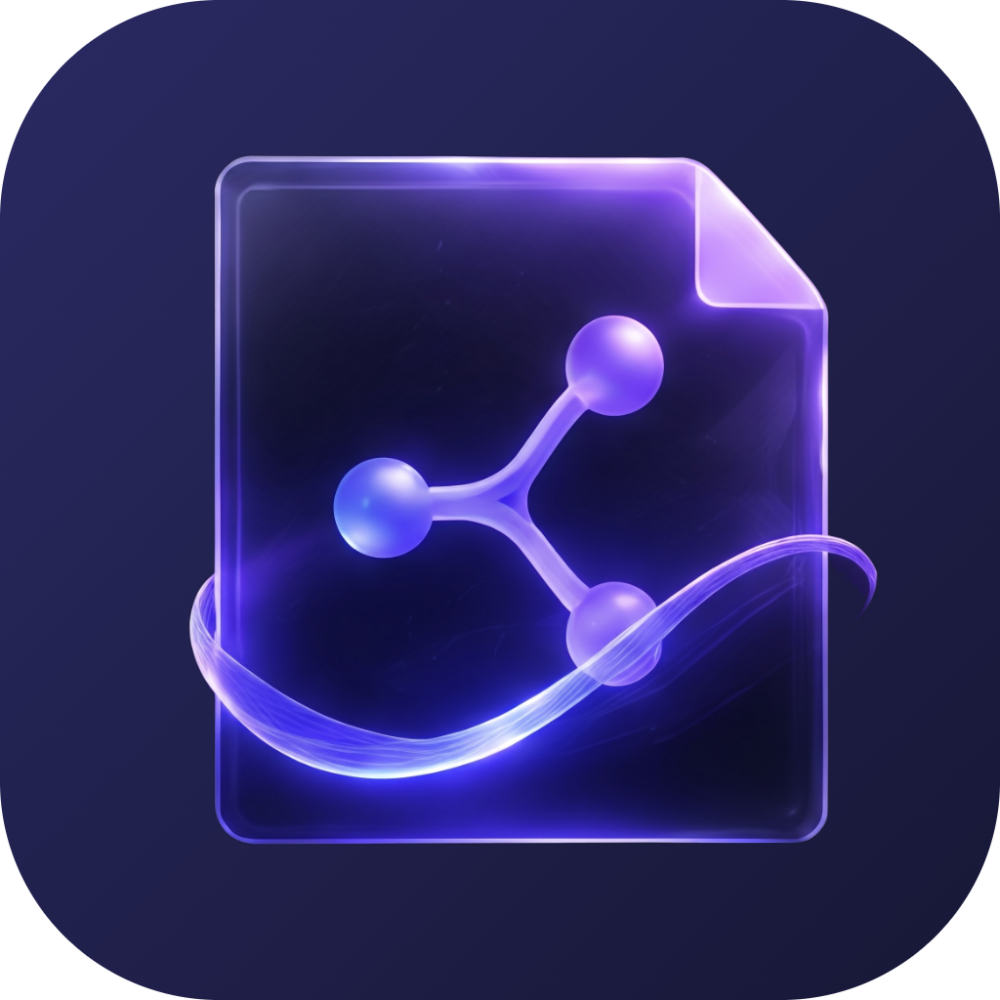
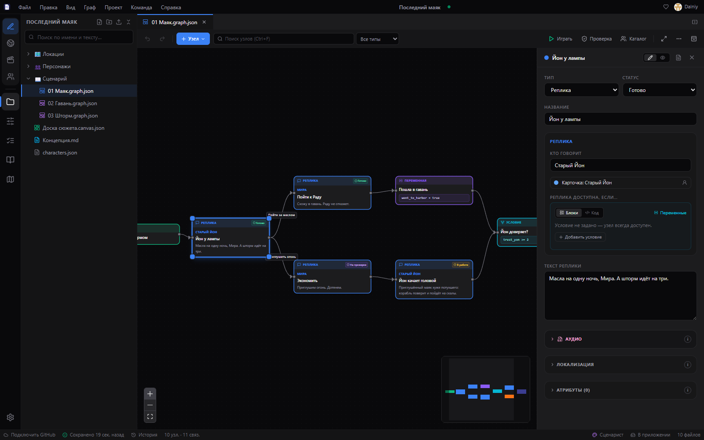
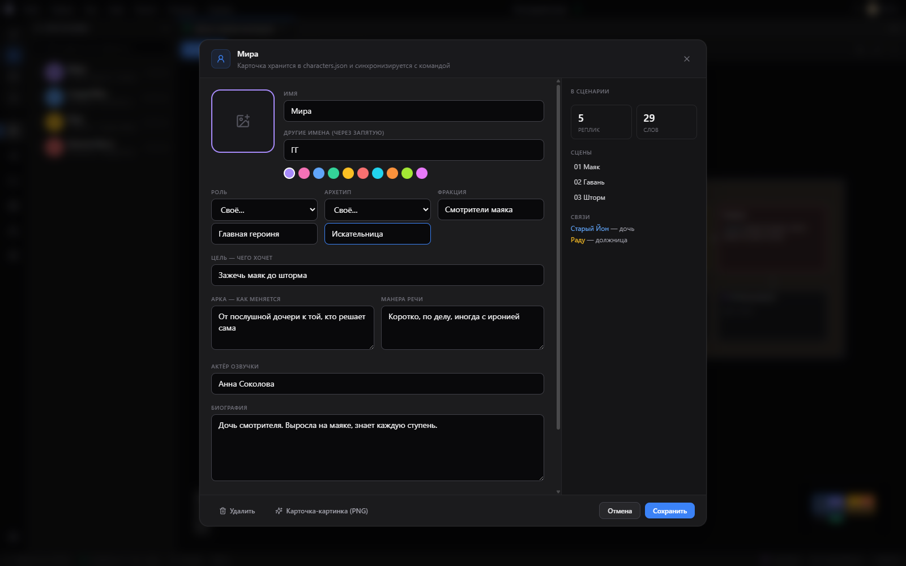
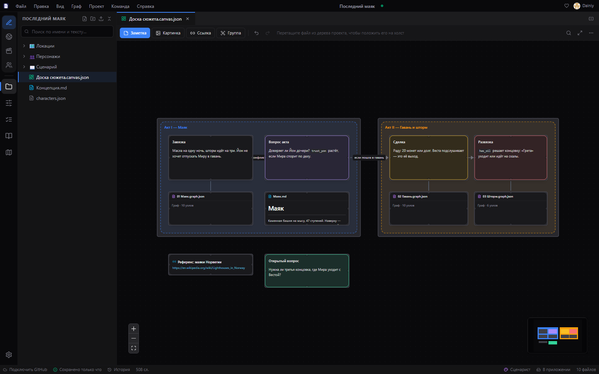

<!-- narrata:landing:start -->

  

<h1 align="center">Narrata</h1>

A workspace for narrative designers and writers: dialogue and quest graphs, a character base, canvases, script checks and team work through GitHub — free and without a server of your own.

  
  

<a href="https://github.com/DalniyX/narrata-releases/releases/latest"><b>⬇️ Download for Windows and Android</b></a>

<a href="https://narrata.space/changelog.html">What’s new</a> · Full change history: <a href="CHANGELOG.en.md">English</a> · <a href="CHANGELOG.md">русский</a>

 

## Features

- 🕸️ **Dialogue and quest graphs** — Branches, conditions and variables; play a dialogue like a game right on the graph, with speaker portraits. A playable version as one HTML file — for a client or a tester.
- 🤝 **Team through GitHub** — Sync, tasks, chat, roles and private folders — no server of your own.
- 🧩 **Canvas** — Notes, documents, pictures and links — one board next to the graph.
- ✅ **Script check** — Dead ends, unreachable branches and broken conditions — before a player finds them.
- 📜 **Documents** — Markdown with wiki links and a focus mode — just the text, no panels. Word and Excel editing right in the app.
- 🌍 **Localization and voice-over** — A translation table, XLIFF, and scripts for voice actors.
- 🎮 **Engine export** — Unity, Godot, Unreal, Ren’Py, Ink, Yarn Spinner, Twine — no hand-rolled JSON.
- 👥 **Character base** — Cards, relationships between characters, voice actors and lines by scene.
- 📱 **Windows and Android** — The same project on a computer and a tablet, with self-updates.

## Installation

- **Windows 10 and 11** — download `Narrata-Setup-….exe` from the [releases page](https://github.com/DalniyX/narrata-releases/releases/latest) and run it. The installer is not code-signed yet, so Windows may show “Unknown publisher”: click “More info” → “Run anyway”. After that the app updates itself.
- **Android** — download the `.apk` from the same page and open it on the device; allow installs from this source once. The app offers new versions by itself. A tablet works best: everything runs on a phone, but graphs and the canvas have more room on a big screen.

### Requirements

| 🪟 Windows | 🤖 Android |
| --- | --- |
| Windows 10 (1809) or 11, 64-bit | Android 7.0 or newer · 📱 a tablet works best |
| 4 GB RAM, 400 MB of disk space | An up-to-date Android System WebView |
| Updates itself, no administrator rights needed | Stable versions only — betas ship for Windows |

## Community and support

[Website](https://narrata.space/) · [Telegram](https://t.me/DalniyX) · [Boosty](https://boosty.to/narrata/donate) · [DonationAlerts](https://dalink.to/dalniyx)

## Feedback

Found a bug or have an idea — use “Help → Feedback” in the app or [open an issue on GitHub](https://github.com/DalniyX/narrata-releases/issues).

## License

Narrata is closed-source software; this repository only hosts the installers. Installing means accepting the [end-user license agreement](LICENSE.md): copying, redistributing the installers elsewhere or decompiling the app without the copyright holder's permission is not allowed.

<!-- narrata:landing:end -->

<!-- narrata:supporters:start -->
## ❤️ Thanks

Thank you to everyone who supports Narrata!

_The list is empty so far — be the first._
<!-- narrata:supporters:end -->
